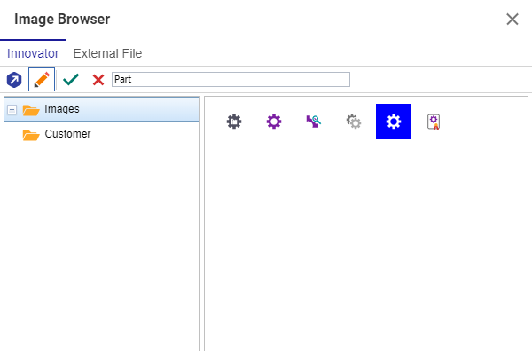

# Image Browser Searchbar

The Image Browser inside of Aras Innovator is most commonly used to allow administrators to set icons on ItemTypes. Icons are a convenient way to make your different ItemTypes visually distinct at a quick glance. Aras Innovator ships with a number of pre-made standard ItemTypes to use, but finding the right one can too often involve scrolling through a long list of images. This project adds a search bar to the image browser to allow users to quickly filter the list of available images to find one that matches their search criteria.

## Project Details

#### Built Using:
Aras 12.0

#### History:
Release | Notes
--------|--------
[v1.0](https://github.com/ArasLabs/image-browser-searchbar/releases/tag/v1.0) | Initial Release

#### Supported Aras Versions
Project | Notes
--------|--------
[v1.0](https://github.com/ArasLabs/image-browser-searchbar/releases/tag/v1.0) | 12.0

## Installation

#### Important!
**Always back up your code tree and database before applying an import package or code tree patch!**

### Pre-requisites

1. Aras Innovator installed (version 12.0 preferred)

#### Code tree Installation

1. Backup your code tree and store the archive in a safe place
2. Navigate to your local `..\AlternateMethodEditor\` folder
3. Copy the `\Innovator\` folder
4. Paste this at the root of your install directory
    + By default this is `C:\Program Files\Aras\Innovator\`

####

You are now ready to login to Aras and try out the Alternate Method Editor

## Usage

1. Log in to Aras as admin
2. Navigate to **Administration > ItemTypes**
3. Open any ItemType
4. Edit the ItemType
5. Under either icon field, choose to add a new icon to launch the image browser
    * This dialog should now appear with a search bar at the top
6. Type in some text into the search bar
7. Click outside of the search bar to apply the filter
    * In the future, this filter should be applied automatically as typing happens or on a press of the Enter key
8. Confirm that the list of images is filtered based on your search criteria

For more information on contributing to this project, another Aras Labs project, or any Aras Community project, shoot us an email at araslabs@aras.com.

## Credits

Original Aras community project written by Christopher Gillis at Aras Corp.

Documented and published by Christopher Gillis for Aras Labs. @cgillis-aras

## License

Aras Labs projects are published to Github under the MIT license. See the [LICENSE file](./LICENSE) for license rights and limitations.